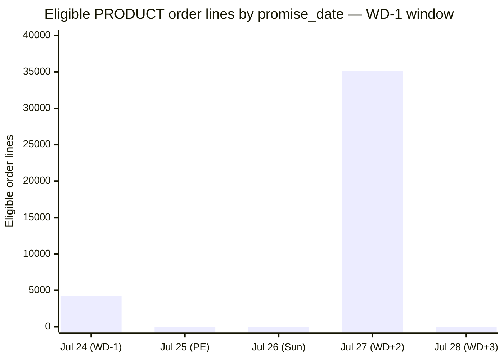
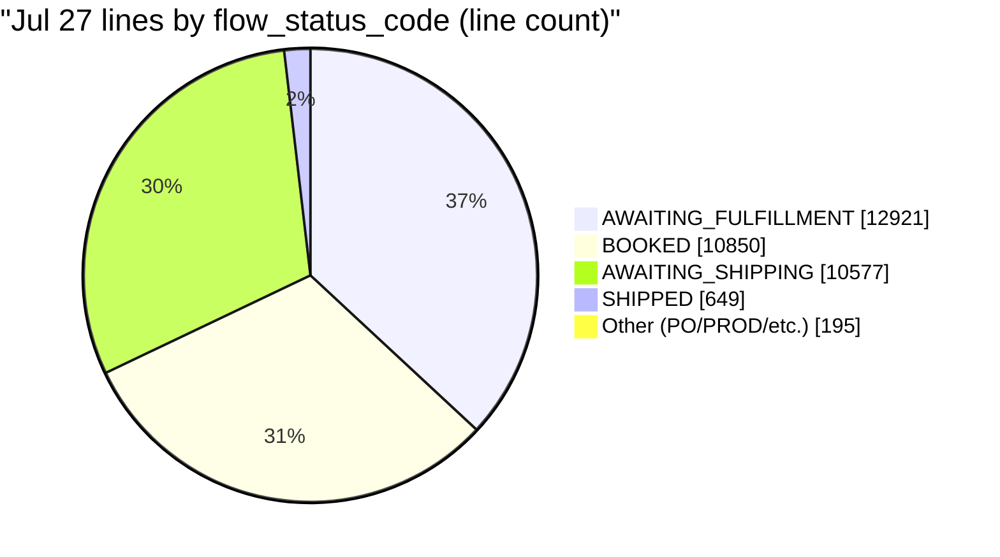
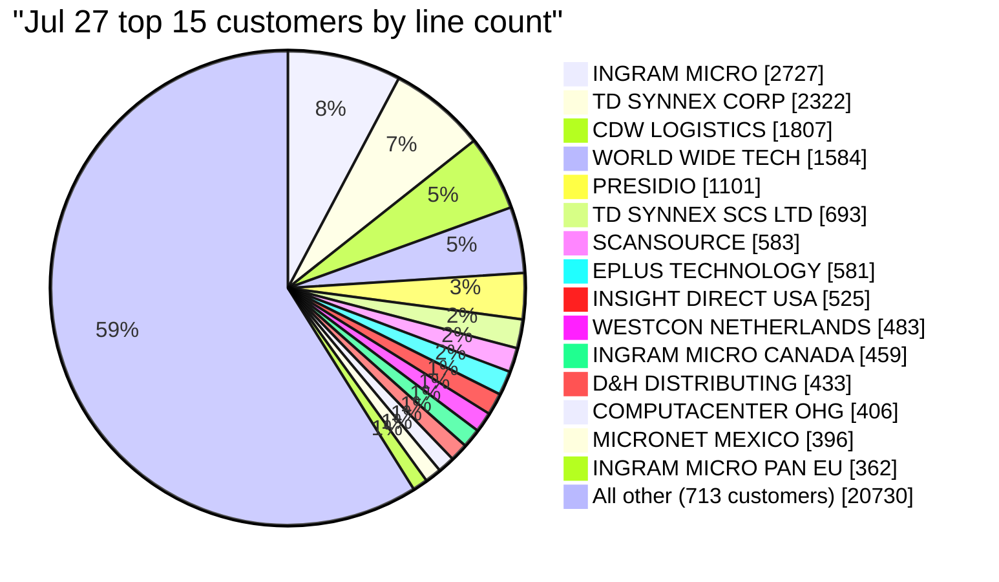

# JUL-26 YE / WD-1 Mid-Close Prediction — Pipeline Drill-Down & Override Analysis

**Report date:** 2026-07-24 (WD-1 of JUL-26 close)
**Fiscal context:** JUL-26 is the final period of FY26 (Cisco fiscal year end).
**Author:** Jack Sloop (Revenue Operations Monitoring)
**System of record:** [`ARFINRO.JSR_WD0_PREDICTIONS`](revenue-monitoring-server/src/main/java/com/cisco/des/o2c/rev/revenuemonitoringserver/services/Wd0PredictiveService.java) / [`ARFINRO.JSR_WD0_RAW_SNAPSHOTS`](revenue-monitoring-server/src/main/java/com/cisco/des/o2c/rev/revenuemonitoringserver/services/Wd0PredictiveService.java)

---

## 1. Executive Summary

At WD-1 of the JUL-26 (fiscal-year-end) close, the automated mid-close prediction model produced a PRODUCT HIGH of **~83,000 order lines** and a SERVICE HIGH of **~13,400 order lines**. Both bounds were manually overridden in the database before publication:

| Line type | Model LOW |  Model HIGH | **Overridden LOW** | **Overridden HIGH** |                  Δ HIGH |
| --------- | --------: | ----------: | -----------------: | ------------------: | ----------------------: |
| PRODUCT   |   ~14,150 | **~82,997** |             19,436 |              38,267 | **−44,730** (tightened) |
| SERVICE   |    ~5,150 | **~13,399** |             21,747 |              46,543 |  **+33,144** (loosened) |

The model's PRODUCT HIGH is arithmetically defensible: **35,192 eligible order lines are sitting on `promise_date = 2026-07-27`** (the Monday inside the WD-1 window) — 11,837 distinct orders across 728 customers, $10.72B in ordered value, dominated by the standard Cisco distributor channel (Ingram, TD SYNNEX, CDW, WWT, Presidio, etc.). Applying the historically calibrated QE-HIGH multiplier of 3.28 to this weighted eligible count is what generates the 83k figure.

**Interpretation:** The PRODUCT HIGH override implies expecting > 55% of the Jul 27 pipeline to slip past year-end. That may or may not be accurate — this document exists so that once JUL-26 actuals land on 2026-07-27, we can measure it, and so that any future override happens with full understanding of what was overridden.

The comprehensive model-status report is in [WD0_MIDCLOSE_MODEL_STATUS.md](WD0_MIDCLOSE_MODEL_STATUS.md); §9 of that document contains the full audit trail. This document is a focused drill-down on the JUL-26 signal itself.

---

## 2. Background — how the model works

Automated by [`Wd0PredictiveService.java`](revenue-monitoring-server/src/main/java/com/cisco/des/o2c/rev/revenuemonitoringserver/services/Wd0PredictiveService.java), a verbatim port of Jae Won's manual "May Edition" workbook. Three source queries feed two line-type predictions.

|   # | Segment     | Source query                                                                                                                                                          | Reads from                                                | Window      | Non-zero per-day weights                                            |
| --: | ----------- | --------------------------------------------------------------------------------------------------------------------------------------------------------------------- | --------------------------------------------------------- | ----------- | ------------------------------------------------------------------- |
|   1 | **PRODUCT** | `PROMISE_DATE` ([L118](revenue-monitoring-server/src/main/java/com/cisco/des/o2c/rev/revenuemonitoringserver/services/Wd0PredictiveService.java#L118))                | `finfblrl.cg1_oe_order_lines_all@FINFBLBLO_LINK`          | PE−1 → PE+3 | −1: 0.45, +2: 0.65                                                  |
|   2 | **SERVICE** | `FLEXIBLE_INVOICE` ([L72](revenue-monitoring-server/src/main/java/com/cisco/des/o2c/rev/revenuemonitoringserver/services/Wd0PredictiveService.java#L72))              | `apps.xxgco_oe_invoice_schedules`                         | PE → PE+1   | 0: 0.65, +1: 1.00                                                   |
|   3 | **SERVICE** | `FUTURE_INVOICE_RELEASE` (FIRD) ([L92](revenue-monitoring-server/src/main/java/com/cisco/des/o2c/rev/revenuemonitoringserver/services/Wd0PredictiveService.java#L92)) | `apps.xxgco_oe_order_lines_ext ⋈ apps.oe_order_lines_all` | PE−3 → PE+3 | −3: 0.45, −2: 0.45, −1: 0.45, 0: 0.65, +1: 1.00, +2: 0.65, +3: 0.47 |

**Formula:**

```
WEIGHTED_SUM(segment) = SUM over days d of ( line_count[d] × per_day_weight[d] )

PREDICTION_LOW  = WEIGHTED_SUM × WD_LOW(wd, period_type)
PREDICTION_HIGH = WEIGHTED_SUM × WD_HIGH(wd, period_type)
```

**WD × period-type multiplier table** ([L207-215](revenue-monitoring-server/src/main/java/com/cisco/des/o2c/rev/revenuemonitoringserver/services/Wd0PredictiveService.java#L207-L215)):

| WD   | ME (low, high) | QE / YE (low, high) |
| ---- | -------------- | ------------------- |
| WD-3 | (0.27, 1.76)   | **(0.54, 3.52)**    |
| WD-2 | (0.36, 1.73)   | **(0.72, 3.46)**    |
| WD-1 | (0.63, 1.64)   | **(1.26, 3.28)**    |

QE/YE multipliers are exactly 2× the ME multipliers — Jae Won's calibration against FY23–FY25 historical actuals showed that quarter-end and year-end days close ~2× the volume of a typical month-end day, because of the last-day sales push.

---

## 3. The Signal — Jul 27 pileup

### 3.1 Per-day counts inside the WD-1 window

Live re-run of `PRODUCT_PROMISE_DATE_SQL` on 2026-07-24 (see Appendix A.1):

| promise_date                          | line_count | day_offset from PE | per_day_weight | weighted_contribution |
| ------------------------------------- | ---------: | -----------------: | -------------: | --------------------: |
| 2026-07-24                            |      4,198 |                 −1 |           0.45 |                 1,889 |
| 2026-07-25 (PE, Saturday)             |          0 |                  0 |           0.00 |                     0 |
| 2026-07-26 (Sunday)                   |          0 |                 +1 |           0.00 |                     0 |
| **2026-07-27**                        | **35,192** |             **+2** |       **0.65** |            **22,875** |
| 2026-07-28                            |        (0) |                 +3 |           0.00 |                     0 |
| **Total PRODUCT WEIGHTED_SUM (live)** |            |                    |                |          **≈ 24,764** |

(At the WD-1 snapshot run earlier today the counts were 4,920 and 35,523 respectively, yielding `WEIGHTED_SUM = 25,304`. Small drift is normal — some lines have moved to `CLOSED` / `CANCELLED` in the intervening hours.)



**One day — Monday Jul 27 — is 92% of the entire PRODUCT weighted sum.** This is what the model is reacting to.

### 3.2 Jul 27 headline metrics

| Metric                                |          Value |
| ------------------------------------- | -------------: |
| Total eligible lines                  |     **35,192** |
| Distinct orders (`header_id`)         |     **11,837** |
| Distinct customers (`sold_to_org_id`) |        **728** |
| Total ordered value                   | **≈ $10.72 B** |
| Avg unit selling price                |        $83,453 |
| Median unit selling price             |        $766.56 |
| Avg lines per order                   |           2.97 |

### 3.3 By flow status



| Flow status          |  Lines | Share of lines | Ordered value | Share of value |
| -------------------- | -----: | -------------: | ------------: | -------------: |
| AWAITING_FULFILLMENT | 12,921 |          36.7% |       $1.75 B |          16.3% |
| BOOKED               | 10,850 |          30.8% |   **$8.19 B** |      **76.4%** |
| AWAITING_SHIPPING    | 10,577 |          30.1% |        $736 M |           6.9% |
| SHIPPED              |    649 |           1.8% |         $18 M |           0.2% |
| PO_OPEN              |     92 |           0.3% |         $32 M |           0.3% |
| PRODUCTION_OPEN      |     84 |           0.2% |        $0.8 M |          <0.1% |
| Other (5 statuses)   |     19 |           0.1% |          $3 M |          <0.1% |

`BOOKED` is only 31% of lines but 76% of dollar value — that's where the big-ticket software / subscription / large-enterprise deals sit, staged for FY-end revenue release. `AWAITING_FULFILLMENT` + `AWAITING_SHIPPING` (67% of lines) is the physical hardware channel push.

### 3.4 By customer (top 15)

Names resolved via `apps.hz_cust_accounts ⋈ apps.hz_parties`.



|   # | Customer                                |              Lines |    Ordered value |
| --: | --------------------------------------- | -----------------: | ---------------: |
|   1 | INGRAM MICRO                            |              2,727 |          $28.5 M |
|   2 | TD SYNNEX CORPORATION                   |              2,322 |          $31.7 M |
|   3 | CDW LOGISTICS LLC                       |              1,807 |          $17.7 M |
|   4 | WORLD WIDE TECHNOLOGY INC               |              1,584 |          $28.5 M |
|   5 | PRESIDIO NETWORKED SOLUTIONS GROUP, LLC |              1,101 |          $12.1 M |
|   6 | TD SYNNEX SUPPLY CHAIN SERVICES LIMITED |                693 |          $10.8 M |
|   7 | SCANSOURCE INC                          |                583 |           $7.7 M |
|   8 | EPLUS TECHNOLOGY INC                    |                581 |           $5.0 M |
|   9 | INSIGHT DIRECT USA INC                  |                525 |           $6.9 M |
|  10 | WESTCON GROUP NETHERLANDS B V           |                483 |           $9.1 M |
|  11 | INGRAM MICRO INC CANADA                 |                459 |           $3.7 M |
|  12 | D&H DISTRIBUTING COMPANY                |                433 |           $4.9 M |
|  13 | COMPUTACENTER AG & CO. OHG              |                406 |           $9.6 M |
|  14 | MICRONET DE MEXICO SA DE CV             |                396 |      **$29.1 M** |
|  15 | INGRAM MICRO PAN EUROPE GMBH            |                362 |          $12.1 M |
|   — | **Top 15 total**                        | **14,462 (41.1%)** |  $217.5 M (2.0%) |
|   — | All other 713 customers                 |     20,730 (58.9%) | $10.51 B (98.0%) |

**No concentration risk.** The largest single customer (Ingram Micro) accounts for 7.7% of Jul 27 lines. All top-15 names are established Cisco channel distributors and global VARs. Nothing anomalous; this is a broad year-end push through the normal channel.

### 3.5 By line type (region)

All top-15 line types resolved via `apps.oe_transaction_types_tl` are `Standard-PRD-*-L` (Standard Revenue Order — Product) across geographies. **Zero SERVICE line types in the top 15** — this data flows exclusively through the PRODUCT input query; SERVICE has its own two independent inputs (Section 2) and is unaffected.

| Line type             | Region         |   Lines |                       Ordered value |
| --------------------- | -------------- | ------: | ----------------------------------: |
| Standard-PRD-US-L     | United States  |  16,811 |                            $207.9 M |
| Standard-PRD-UKH-L    | UK / EMEAR Hub |  11,479 |                            $121.5 M |
| Standard-PRD-MX-L     | Mexico         |   1,405 |                            $132.3 M |
| Standard-PRD-IN-L     | India          |   1,228 |                            $537.3 M |
| Standard-PRD-CAN-L    | Canada         |     900 |                              $8.5 M |
| Standard-PRD-AUS-L    | Australia      |     816 |                             $10.5 M |
| **Standard-PRD-KR-L** | **Korea**      | **761** | **$9,649.4 M** ← subscription-heavy |
| Standard-PRD-DE-L     | Germany        |     429 |                             $20.9 M |
| Standard-PRD-BR-L     | Brazil         |     363 |                             $13.6 M |
| Standard-PRD-JP-L     | Japan          |     351 |                              $2.6 M |
| Standard-PRD-CN-L     | China          |     179 |                              $5.0 M |
| Standard-PRD-ES-L     | Spain          |     168 |                              $2.3 M |
| Standard-PRD-IT-L     | Italy          |     144 |                              $4.9 M |
| Standard-PRD-FR-L     | France         |      61 |                              $1.1 M |
| Standard-PRD-NL-L     | Netherlands    |      29 |                              $0.2 M |

The `Standard-PRD-KR-L` (Korea) $9.65B on 761 lines is the dominant dollar-value bucket — 90% of Jul 27's ordered value comes from Korea line-type contracts, driven by very high unit prices. Worth flagging to APJC finance if not already known.

---

## 4. Model math — how 25,304 becomes 82,997

At the snapshot capture time earlier today, the model recorded:

```
WEIGHTED_SUM(PRODUCT) = (4,920 × 0.45) + (35,523 × 0.65)
                      =   2,214    +   23,090
                      =  25,304

PREDICTION_LOW  = 25,304 × 1.26 = 31,883   (as computed by the model)
PREDICTION_HIGH = 25,304 × 3.28 = 82,997   (as computed by the model)
```

Then the DB row was overridden to `PREDICTION_LOW = 19,436` and `PREDICTION_HIGH = 38,267`, without touching `WEIGHTED_SUM` or the raw snapshot bucket rows. Full audit is in [WD0_MIDCLOSE_MODEL_STATUS.md §9](WD0_MIDCLOSE_MODEL_STATUS.md).

**What the override implies numerically:** for the actual to land inside the overridden HIGH of 38,267, less than **45%** of the currently eligible Jul 27 pipeline (35,192 lines) can close by end of business on Jul 27. Put differently, **> 55% of the currently eligible Jul 27 lines would need to slip past year-end or be cancelled**. Historical WD-1 → WD0 conversion rates at year-end sit closer to 60–90% based on the FY23–FY25 calibration window Jae Won used to derive the 3.28 multiplier.

---

## 5. Audit trail

| Timestamp (Pacific) | Row (`PREDICTION_ID`) | WD   | Line type | Action               | Actor                                    |
| ------------------- | --------------------- | ---- | --------- | -------------------- | ---------------------------------------- |
| 2026-07-22 15:00    | 863                   | WD-3 | PRODUCT   | Model insert         | Wd0PredictiveJob                         |
| 2026-07-22 15:00    | 864                   | WD-3 | SERVICE   | Model insert         | Wd0PredictiveJob                         |
| 2026-07-22 (later)  | 863, 864              | WD-3 | both      | LOW/HIGH overwritten | DBA                                      |
| 2026-07-23 15:00    | 883                   | WD-2 | PRODUCT   | Model insert         | Wd0PredictiveJob                         |
| 2026-07-23 15:00    | 884                   | WD-2 | SERVICE   | Model insert         | Wd0PredictiveJob                         |
| 2026-07-23 (later)  | 883, 884              | WD-2 | both      | LOW/HIGH overwritten | DBA                                      |
| 2026-07-24 15:00    | 903                   | WD-1 | PRODUCT   | Model insert         | Wd0PredictiveJob                         |
| 2026-07-24 15:00    | 904                   | WD-1 | SERVICE   | Model insert         | Wd0PredictiveJob                         |
| 2026-07-24 (later)  | 903, 904              | WD-1 | both      | LOW/HIGH overwritten | Jack Sloop (applied DBA-directed values) |

Original (model) LOW/HIGH values are reconstructable from `WEIGHTED_SUM × multiplier(wd, YE)` using the table in Section 2. The multiplier constants are hard-coded in [`Wd0PredictiveService.WD_MULTIPLIERS`](revenue-monitoring-server/src/main/java/com/cisco/des/o2c/rev/revenuemonitoringserver/services/Wd0PredictiveService.java#L207) and haven't changed. `JSR_WD0_RAW_SNAPSHOTS` rows for these predictions are also untouched — those are the durable source of truth.

**Recommended schema addition (not yet applied):**

```sql
ALTER TABLE ARFINRO.JSR_WD0_PREDICTIONS ADD (
    IS_OVERRIDDEN NUMBER(1) DEFAULT 0 NOT NULL,
    OVERRIDDEN_LOW  NUMBER,
    OVERRIDDEN_HIGH NUMBER,
    OVERRIDE_ACTOR  VARCHAR2(100),
    OVERRIDE_AT     TIMESTAMP,
    OVERRIDE_NOTE   VARCHAR2(4000)
);
```

Backfilling the 6 JUL-26 rows would preserve both the model output and the published output atomically.

---

## 6. Appendix A — SQL used

### A.1 Per-day counts (verbatim from `Wd0PredictiveService.PRODUCT_PROMISE_DATE_SQL`)

```sql
WITH TEMP_MIDCLOSE_PROMISE_DATE AS (
    SELECT *
      FROM finfblrl.cg1_oe_order_lines_all@FINFBLBLO_LINK.CISCO.COM
     WHERE promise_date BETWEEN DATE '2026-07-24' AND DATE '2026-07-28'
)
SELECT TRUNC(b.promise_date) AS promise_date, COUNT(*) AS line_count
  FROM TEMP_MIDCLOSE_PROMISE_DATE b
 WHERE NVL(b.accounting_rule_id, 1) = 1
   AND b.flow_status_code NOT IN ('CLOSED', 'CANCELLED')
   AND b.unit_selling_price <> 0
   AND NOT EXISTS (SELECT 1 FROM ra_customer_trx_lines_all l
                    WHERE l.interface_line_attribute6 = TO_CHAR(b.line_id))
   AND NOT EXISTS (SELECT 1 FROM apps.ra_interface_lines_all l
                    WHERE l.interface_line_attribute6 = TO_CHAR(b.line_id))
 GROUP BY TRUNC(b.promise_date)
 ORDER BY 1;
```

> **NOTE on the date window:** Use `AND DATE '2026-07-28'` (not `'2026-07-27'`). `DATE '2026-07-27'` = midnight of Jul 27, so `BETWEEN ... AND DATE '2026-07-27'` clips any Jul 27 rows whose `promise_date` has a non-midnight time component. This is why `Wd0PredictiveService.windowFor(PRODUCT_PROMISE_DATE, PE)` uses `PE−1 → PE+3` and not `PE−1 → PE+2`.

### A.2 Top customers on Jul 27

```sql
WITH TEMP_MIDCLOSE_PROMISE_DATE AS (
    SELECT *
      FROM finfblrl.cg1_oe_order_lines_all@FINFBLBLO_LINK.CISCO.COM
     WHERE promise_date >= DATE '2026-07-27'
       AND promise_date <  DATE '2026-07-28'
),
FILTERED AS (
    SELECT b.sold_to_org_id, b.ordered_quantity, b.unit_selling_price
      FROM TEMP_MIDCLOSE_PROMISE_DATE b
     WHERE NVL(b.accounting_rule_id, 1) = 1
       AND b.flow_status_code NOT IN ('CLOSED', 'CANCELLED')
       AND b.unit_selling_price <> 0
       AND NOT EXISTS (SELECT 1 FROM ra_customer_trx_lines_all l
                        WHERE l.interface_line_attribute6 = TO_CHAR(b.line_id))
       AND NOT EXISTS (SELECT 1 FROM apps.ra_interface_lines_all l
                        WHERE l.interface_line_attribute6 = TO_CHAR(b.line_id))
),
AGG AS (
    SELECT sold_to_org_id,
           COUNT(*)                                                 AS line_count,
           SUM(ordered_quantity)                                    AS total_qty,
           ROUND(SUM(ordered_quantity * unit_selling_price), 0)     AS total_value_usd
      FROM FILTERED
     GROUP BY sold_to_org_id
)
SELECT a.sold_to_org_id,
       p.party_name,
       a.line_count,
       a.total_qty,
       a.total_value_usd
  FROM AGG a
  LEFT JOIN apps.hz_cust_accounts hca ON hca.cust_account_id = a.sold_to_org_id
  LEFT JOIN apps.hz_parties       p   ON p.party_id = hca.party_id
 ORDER BY a.line_count DESC
 FETCH FIRST 25 ROWS ONLY;
```

### A.3 Flow-status breakdown on Jul 27

```sql
WITH TEMP_MIDCLOSE_PROMISE_DATE AS (
    SELECT *
      FROM finfblrl.cg1_oe_order_lines_all@FINFBLBLO_LINK.CISCO.COM
     WHERE promise_date >= DATE '2026-07-27'
       AND promise_date <  DATE '2026-07-28'
)
SELECT b.flow_status_code,
       COUNT(*)                                                     AS line_count,
       ROUND(SUM(b.ordered_quantity * b.unit_selling_price), 0)     AS total_value_usd
  FROM TEMP_MIDCLOSE_PROMISE_DATE b
 WHERE NVL(b.accounting_rule_id, 1) = 1
   AND b.flow_status_code NOT IN ('CLOSED', 'CANCELLED')
   AND b.unit_selling_price <> 0
   AND NOT EXISTS (SELECT 1 FROM ra_customer_trx_lines_all l
                    WHERE l.interface_line_attribute6 = TO_CHAR(b.line_id))
   AND NOT EXISTS (SELECT 1 FROM apps.ra_interface_lines_all l
                    WHERE l.interface_line_attribute6 = TO_CHAR(b.line_id))
 GROUP BY b.flow_status_code
 ORDER BY line_count DESC;
```

### A.4 Line-type breakdown on Jul 27

```sql
WITH TEMP_MIDCLOSE_PROMISE_DATE AS (
    SELECT *
      FROM finfblrl.cg1_oe_order_lines_all@FINFBLBLO_LINK.CISCO.COM
     WHERE promise_date >= DATE '2026-07-27'
       AND promise_date <  DATE '2026-07-28'
),
AGG AS (
    SELECT b.line_type_id,
           COUNT(*)                                                 AS line_count,
           ROUND(SUM(b.ordered_quantity * b.unit_selling_price), 0) AS total_value_usd
      FROM TEMP_MIDCLOSE_PROMISE_DATE b
     WHERE NVL(b.accounting_rule_id, 1) = 1
       AND b.flow_status_code NOT IN ('CLOSED', 'CANCELLED')
       AND b.unit_selling_price <> 0
       AND NOT EXISTS (SELECT 1 FROM ra_customer_trx_lines_all l
                        WHERE l.interface_line_attribute6 = TO_CHAR(b.line_id))
       AND NOT EXISTS (SELECT 1 FROM apps.ra_interface_lines_all l
                        WHERE l.interface_line_attribute6 = TO_CHAR(b.line_id))
     GROUP BY b.line_type_id
)
SELECT a.line_type_id,
       t.name         AS line_type_name,
       a.line_count,
       a.total_value_usd
  FROM AGG a
  LEFT JOIN apps.oe_transaction_types_tl t
    ON t.transaction_type_id = a.line_type_id AND t.language = 'US'
 ORDER BY a.line_count DESC
 FETCH FIRST 15 ROWS ONLY;
```

### A.5 Headline metrics on Jul 27

```sql
WITH TEMP_MIDCLOSE_PROMISE_DATE AS (
    SELECT *
      FROM finfblrl.cg1_oe_order_lines_all@FINFBLBLO_LINK.CISCO.COM
     WHERE promise_date >= DATE '2026-07-27'
       AND promise_date <  DATE '2026-07-28'
)
SELECT COUNT(*)                                                     AS total_lines,
       COUNT(DISTINCT b.header_id)                                  AS distinct_orders,
       COUNT(DISTINCT b.sold_to_org_id)                             AS distinct_customers,
       ROUND(SUM(b.ordered_quantity * b.unit_selling_price), 0)     AS total_value_usd,
       ROUND(AVG(b.unit_selling_price), 2)                          AS avg_unit_price,
       ROUND(MEDIAN(b.unit_selling_price), 2)                       AS median_unit_price
  FROM TEMP_MIDCLOSE_PROMISE_DATE b
 WHERE NVL(b.accounting_rule_id, 1) = 1
   AND b.flow_status_code NOT IN ('CLOSED', 'CANCELLED')
   AND b.unit_selling_price <> 0
   AND NOT EXISTS (SELECT 1 FROM ra_customer_trx_lines_all l
                    WHERE l.interface_line_attribute6 = TO_CHAR(b.line_id))
   AND NOT EXISTS (SELECT 1 FROM apps.ra_interface_lines_all l
                    WHERE l.interface_line_attribute6 = TO_CHAR(b.line_id));
```

### A.6 Post-hoc actual vs prediction (run after JUL-26 actuals load on 2026-07-27)

```sql
-- Compare the published (overridden) bound and the reconstructed model bound
-- against real JUL-26 actuals from ASK_QE_ME_INTERFACE_LOAD.
WITH ACTUALS AS (
    SELECT line_type, line_count
      FROM arfinro.ASK_QE_ME_INTERFACE_LOAD
     WHERE close_type  = 'MIDCLOSE'
       AND period_name = 'JUL-26'
),
PREDS AS (
    SELECT wd, line_type,
           weighted_sum,
           prediction_low   AS published_low,
           prediction_high  AS published_high,
           -- reconstruct the model's original outputs from WEIGHTED_SUM
           CASE wd WHEN 'WD-3' THEN ROUND(weighted_sum * 0.54)
                    WHEN 'WD-2' THEN ROUND(weighted_sum * 0.72)
                    WHEN 'WD-1' THEN ROUND(weighted_sum * 1.26) END AS model_low,
           CASE wd WHEN 'WD-3' THEN ROUND(weighted_sum * 3.52)
                    WHEN 'WD-2' THEN ROUND(weighted_sum * 3.46)
                    WHEN 'WD-1' THEN ROUND(weighted_sum * 3.28) END AS model_high
      FROM ARFINRO.JSR_WD0_PREDICTIONS
     WHERE period_name = 'JUL-26'
       AND wd IN ('WD-3','WD-2','WD-1')
)
SELECT p.wd, p.line_type,
       a.line_count AS actual,
       p.published_low, p.published_high,
       p.model_low,     p.model_high,
       CASE WHEN a.line_count BETWEEN p.published_low AND p.published_high THEN 'YES' ELSE 'NO' END AS in_published_band,
       CASE WHEN a.line_count BETWEEN p.model_low     AND p.model_high     THEN 'YES' ELSE 'NO' END AS in_model_band
  FROM PREDS p
  LEFT JOIN ACTUALS a ON a.line_type = p.line_type
 ORDER BY p.wd, p.line_type;
```

---

## 7. Interpretation & recommendations

1. **The model's Jul 27 signal is real.** 35,192 eligible lines across 728 customers and 11,837 orders is not a data anomaly, not a duplicate load, and not concentrated in any single deal.
2. **The 3.28 QE-HIGH multiplier is not arbitrary.** It comes from Jae Won's historical calibration against FY23–FY25 actuals (WD-1 QE closing days closed at up to 3.28× the weighted eligible line count). Applied to today's `WEIGHTED_SUM` of 25,304, it produces 82,997 — that's the model's HIGH, and it's defensible math.
3. **The override tightened PRODUCT HIGH by 44,730 lines.** This may be right based on DBA judgment about specific known slips; without a documented reason attached to the override we can't measure whether it was correct.
4. **This is our first chance to grade the model against itself.** JUL-26 actuals land on 2026-07-27 in `ARFINRO.ASK_QE_ME_INTERFACE_LOAD`. Run query A.6 the following day. If the actual lands inside the model band, that's a strong data point that the override was unnecessary; if it lands inside the overridden band, that validates the DBA's read and gives us a training signal for tighter FY27 bounds.
5. **Add the override audit columns** (Section 5). Right now the fact that a value has been overridden is only knowable by comparing DB rows against `WEIGHTED_SUM × multiplier`. That's fine forensically, but should be first-class.
6. **Independent of the override outcome, the multiplier table is due for retraining.** [WD0_MIDCLOSE_MODEL_STATUS.md §3.3](WD0_MIDCLOSE_MODEL_STATUS.md) documents that the published table is PRODUCT-anchored and systematically ~30% too tight when applied to SERVICE. `JSR_WD0_PREDICTIONS` + `JSR_WD0_RAW_SNAPSHOTS` are the first dataset that captures both inputs and outputs atomically; JUL-26 gives us the first labelled row.

---

## 8. Cross-references

- Full model status & background: [WD0_MIDCLOSE_MODEL_STATUS.md](WD0_MIDCLOSE_MODEL_STATUS.md)
- Override audit-trail table: [WD0_MIDCLOSE_MODEL_STATUS.md §9](WD0_MIDCLOSE_MODEL_STATUS.md)
- Source-query implementation: [Wd0PredictiveService.java](revenue-monitoring-server/src/main/java/com/cisco/des/o2c/rev/revenuemonitoringserver/services/Wd0PredictiveService.java)
- Predecessor's manual workbook: `Midclose Prediction Calculation.xlsx` (sheets `WEIGHTAGE`, `QUERIES`, `MinMax Calculations`, `Predictions (FY26 *)`)
- Predecessor's manual SQL: `Midclose_Updated_Prediction_Queries April Edition.sql`

---

_End of report._
